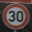
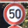
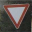

# WriteUp: Self-Driving Car Engineer Nanodegree

## Deep Learning

See here the writeup for the project.

I tried to keep the same titles in the writeup dand in the project itself.

There are some more titles in the write up as the project could not handle the processing of many architectures in one run.

## Project: Build a Traffic Sign Recognition Classifier

* [Load the data](#LoadData)
* [Data Set Summary & Exploration](#SummaryExploration)
* [Design and Test a Model Architecture](#DesignTestModelArchitecture)
* [Include an exploratory visualization of the dataset](#ExploratoryVisualization)
* [Images augmentation](#ImagesAugmentation)
* [Analyze of the architecture](#ArchitectureAnalyze)
    * [Basic framework to describe a convolutional network with a dictionary](#ConvolutionalArchitectureDescription)
* [Train, Validate and Test the Model](#TrainValidateTest)
* [Test a Model on New Images](#TestModelNewImages)
    * [Output Top 5 Softmax Probabilities For Each Image Found on the Web](#5TopSoftmax)
* [Final selected model](#FinalModel)
* [Visualize the Neural Network's State with Test Images](#VisualizeFeatureMaps)
    * [Analyze of the results](#FinalResults)

### Load The Data <a name="LoadData"/>
We load here data stored as training set, validation and test set.
In addition We load a file names `signnames.csv`: this file contains a mappig between label numbers and corresponding names.

Data set are pickled data compose of dictionary with 4 key/value pairs:
- `'features'` is a 4D array containing raw pixel data of the traffic sign images, (num examples, width, height, channels).
- `'labels'` is a 1D array containing the label/class id of the traffic sign. The file `signnames.csv` contains id -> name mappings for each id.
- `'sizes'` is a list containing tuples, (width, height) representing the original width and height the image.
- `'coords'` is a list containing tuples, (x1, y1, x2, y2) representing coordinates of a bounding box around the sign in the image. **THESE COORDINATES ASSUME THE ORIGINAL IMAGE. THE PICKLED DATA CONTAINS RESIZED VERSIONS (32 by 32) OF THESE IMAGES**

### Data Set Summary & Exploration <a name="SummaryExploration"/>

#### Basic summary of the data set

In the code, the analysis is done using python, numpy and pandas methods.

I used the pandas library to calculate summary statistics of the traffic
signs data set:

* The size of training set is 34799
* The size of the validation set is 4410
* The size of test set is 12630
* The shape of a traffic sign image is (32, 32)
* The number of unique classes/labels in the data set is 43

#### Exploratory visualization of the data set

We have 43 labels corresponding to various images whose names are:

     0: 'Speed limit (20km/h)'
     1: 'Speed limit (30km/h)'
     2: 'Speed limit (50km/h)'
     3: 'Speed limit (60km/h)'
     4: 'Speed limit (70km/h)'
     5: 'Speed limit (80km/h)'
     6: 'End of speed limit (80km/h)'
     7: 'Speed limit (100km/h)'
     8: 'Speed limit (120km/h)'
     9: 'No passing'
    10: 'No passing for vehicles over 3.5 metric tons'
    11: 'Right-of-way at the next intersection'
    12: 'Priority road'
    13: 'Yield'
    14: 'Stop'
    15: 'No vehicles'
    16: 'Vehicles over 3.5 metric tons prohibited'
    17: 'No entry'
    18: 'General caution'
    19: 'Dangerous curve to the left'
    20: 'Dangerous curve to the right'
    21: 'Double curve'
    22: 'Bumpy road'
    23: 'Slippery road'
    24: 'Road narrows on the right'
    25: 'Road work'
    26: 'Traffic signals'
    27: 'Pedestrians'
    28: 'Children crossing'
    29: 'Bicycles crossing'
    30: 'Beware of ice/snow'
    31: 'Wild animals crossing'
    32: 'End of all speed and passing limits'
    33: 'Turn right ahead'
    34: 'Turn left ahead'
    35: 'Ahead only'
    36: 'Go straight or right'
    37: 'Go straight or left'
    38: 'Keep right'
    39: 'Keep left'
    40: 'Roundabout mandatory'
    41: 'End of no passing'
    42: 'End of no passing by vehicles over 3.5 metric tons'
    
Here are a few bar charts showing how the data is distributed

##### Training set

##### Validation set

##### Test set

We can see that the ditribution varies for the various classes.
We can see that data sets 20, 21, 22 and 23 differ in number of elements between training and the other data sets.

### Design and Test a Model Architecture <a name= "DesignTestModelArchitecture"/>

#### Convert to gray or y, Normalize, and Crop images
    
Based on the description of http://yann.lecun.com/exdb/publis/pdf/sermanet-ijcnn-11.pdf I wanted to understand the impact of gray scale versus Y extraction out of YUV.

For this reason I set up a dual pipeline:
* One based in Gray scaled images
* One based in Y extraction

The paper however mentions as well that U and V are partially used. Because of lack of time I did not took care about this aspect. What should be done is:
* Extract the 3 layers Y, U and V
* Each layer should be wired to different convolutional networks (U and V require simpler networks than Y)
* Accumulate (inception) all resultes before the last 2 (or 3) fully connected neuronal network stages.

I was wondering as well whether croping out the unrelevant parts of the image would help the neuronal network to better predict an image type.

In order to be able to select between y, gray or gray cropped I have 2 booleans

|boolean| y | gray | gray cropped |
|--|--|--|--|
|use_y_instead_of_grayscale| True | False | False |
|use_cropped_images| X | False | True |

If y is chosen instead of gray validation then tests images will be processed accrodingly.

However, in case cropping is enabled only train images will be cropped.

In addition when leading 5 images at the end of the project, they will be pre processed according to the value of the boolean `use_y_instead_of_grayscale`.

Based on a few papers I read processing RGB images is inefficient. For this reason I did not try this out.

##### A few words on the existing functions
`rgb2gray`
* Converts an image from RGB colors to gray scale

`calculate_coords_resized`
* Calculates the part of the image really useful for analysis. 
* This is a rectangle provided in the data sets as 4 points defining a rectangle.
* These points are refering the image based on its intial size (before it was resized to 32, 32)
* This methods calculates theses coords in the 32, 32 image
* These coords will be later used for 2 things:
    * Crop the image
    * Shift the image to augment the number of samples.
    * This shift will be done within this coords to be sure we do not loose any valuable information.
    

`normalize_gray_images`
* This function will crop the image if croping is enabled
* In addition it will normalized the image as follow:

    mini, maxi = np.min(data_structure['features_gray_cropped'][index]), np.max(data_structure['features_gray_cropped'][index])
    normalized = (data_structure['features_gray_cropped'][index] - mini) / (maxi - mini) * 2 - 1

`RGBToY`
* Converts an image to YUV and returns only Y (If UV had to be taken into account U and V should be returned as well).

`normalize_y_images`
* Takes care of the normalization of the image

### Include an exploratory visualization of the dataset <a name="ExploratoryVisualization"/>

#### Images Y converted
See here an example:

#### Images grayscale converted
See here an example:

#### Images grayscale converted and cropped
See here an example:

    
### Images augmentation <a name="ImagesAugmentation"/>
    
With test data set we could reach at maximum `96.7%` (see below for details).

We could consider that the number of data set could be one problem as the accuracy of the validation data set should be a little more than 99% such that the accuracy of the test data set reaches a good result.

Thus for each image I created 8 augmented ones to allow the network learn more:
* Shift top left bottom right making sure the coords defining the 'coords' value of the image keeps visible
    * The idea is to make sure the network is not only able to learn some part of the image cropping out borders.
* Created 4 images with following rotations in degrees: -15, -5, 5, 15
    * The idea is to make sure the network does not learn the angle of the image: it should be able to recognize an image independantly of its rotation.
* Created a new blur image
    * Some images might be clear other less clear, with this we want the network to learn unclear images.
* Increased brightness of the image
    * Some images might be suffering of sun refelection we simulate such a case with this data augmentation.
    
This led to 278392 additional images thus 313191 images in total.
Training of the network became suddenly much slower because if the so many images to learn.

##### Data disctribution after images augmentation

As we can see, te distribution did not change. Only the number of each image type increased.

##### Example of data augmentation for Y transformed images
See here an example of such a transformation:

##### Example of data augmentation for grayscale transformed images
See here an example of such a transformation:

##### Example of data augmentation for grayscale transformed images and cropped
See here an example of such a transformation:

### Analyze of the architecture<a name ="ArchitectureAnalyze"/>

Before going deeper in the architecture I wanted to understand the variation of some hyper parameters like 
* rate, 
* mu, 
* sigma and 
* keep prob.

#### Variation oh hyper parameters rate mu and sigma
Using a LeNet architecture as follow:
  * 5x5 convolution 
  * followed by a max pooling 
  * followed by 4x4 conulution 
  * followed again by a max pooling.
with gray and croped image and the following parameters:

    keep_prob: 0.600000, epoch = 10
  

| rate  | mu | sigma |   accuracy of validation data set    |
| ------ | ------------- | ------------- |------------|
| 0.000500 | 0.100000 |   0.500000    | 0.938  |
| 0.000500 | 0.200000 |   0.000000    | 0.935  |
| 0.000500 | 0.200000 |   0.100000    | 0.938  |
| 0.000500 | 0.200000 |   0.200000    | 0.922  |
| 0.000500 | 0.200000 |   0.500000    | 0.941  |
| 0.001000 | 0.000000 |   0.200000    | 0.950  |
| 0.001000 | 0.000000 |   0.500000    | 0.945  |
| 0.001000 | 0.100000 |   0.000000    | 0.955  |
| 0.001000 | 0.100000 |   0.100000    | 0.943  |
| 0.001000 | 0.100000 |   0.200000    | 0.921  |
| 0.001000 | 0.500000 |   0.100000    | 0.938  |
| 0.001000 | 0.500000 |   0.200000    | 0.948  |
| 0.001000 | 0.500000 |   0.500000    | 0.935  |
| 0.005000 | 0.000000 |   0.000000    | 0.932  |
| 0.005000 | 0.000000 |   0.100000    | 0.954  |

We can see the best combination is:

| rate  | mu | sigma |   accuration of validation data set    |
| ------ | ------------- | ------------- |------------|
| 0.001000 | 0.100000 |   0.000000    | 0.955102  |

I used BATCH_SIZE = 256 as my computer was able to handle that memory.

The batch size is a hyperparameter that defines the number of samples to work through before updating the internal model parameters.

A batch is like a for-loop iterating over one or more samples and making predictions. At the end of the batch, the predictions are compared to the expected output variables and an error is calculated. From this error, the update algorithm is used to improve the model, e.g. move down along the error gradient.

I performed a similar analysis with keep_prob and found out that 0.65 was mostly the best.

These values will be used to select the best architecture however I plan to measure them another time when the best architecture is selected and additional images are created.

#### Adding more deep connected neurons
I thought maybe a network might learn much better if it has more neurons.

I thought this would have been an evidence and results surprised me quite a bit.

I tried to create more stages of deep connect neurons:

        'wd1': tf.Variable(tf.truncated_normal([400, 300], mean = mu, stddev = sigma)),
        'wd2': tf.Variable(tf.truncated_normal([300, 200], mean = mu, stddev = sigma)),
        'wd3': tf.Variable(tf.truncated_normal([200, 160], mean = mu, stddev = sigma)),
        'wd4': tf.Variable(tf.truncated_normal([160, 86], mean = mu, stddev = sigma)),
        
This did not help much, accuracy did not reach 91% with 10 epochs (this network might need more tuning to be working properly):

    EPOCH 9 ...
    Validation Accuracy = 0.902

    EPOCH 10 ...
    Validation Accuracy = 0.905

### Basic framework to describe a convolutional network with a dictionary<a name ="ConvolutionalArchitectureDescription"/>

As previous results were not convincing I decided to try several architectures with inception.

As I did not want to tweak each time the configuration and suffer of many errors because of wiring problem or number of weights or whatever syntax problem I wanted to use a dynamically configurable architecture.

For this I decided to base a whole architecture on the description of a python data structure.

See below how the syntax was defined based on an example.

##### Name of the architecture 3x3o5x5,3x3o,4x4,2nn

This is the name of the architecture.
Here we see `3x3` (o represents 2 convolutions one followed by the other).
Thus we have a `3x3o5x5` incepted with the output of the `3x3` and incepted with a `4x4`.
The last `2nn` means that there are 2 neuronal network finalizing this whole architecture.

This is just a name and any name could have been used instead but I find this notation useful

    '3x3o5x5,3x3o,4x4,2nn': {   
    
##### Name of the output

This is the name of the output stage that will be returned

            'out_name': 'out',          

##### Definition of sizes of convolutional and neuronal networks

            'convo_nn_size': {          # This is the definition of the various filters and neural networks
            
                'wc11': [3, 3, 1, 12] , # This is a convolutional layer
                'wc12': [3, 3, 12, 24], #
                                        #
                'wc21': [5, 5, 24, 48], #
                'wc22': [5, 5, 48, 96], #
                                        #
                'wc31': [4, 4, 1, 12],  #
                                        #
                                        
                                        
                'wd1':  [7920, 500]   , # This is a fully connected network: this is the most sensible part as the value 7920
                                        # in this case needs to be adapted each time to the number of inceptions
                                        # This could be improved processing the number of outputs based on all 
                                        # parameters but I had no time to improve that part
                'wd2':  [500, 200]    , #
                                        #
                                        
                'out': [200, 43]        # This is the ouput
            },                          #

##### Wiring convolutions and pooling

* Next line defines how all stages are linked together
* For example ['x', 'wc11'] means we want to link x with stage previously defined as wc11
* The algorithm will recognize an output stage name maxpool-2-wc12 as maxpool-maxPoolFilterSize-whateverYouLikeHere
    * This will automatically lead to calculate a max pooling with a stride anf filter size defined by the number `maxPoolFilterSize`.
* If no maxpooling is required then a relu will automatically be appended.
    
            'links_convo': [['x', 'wc11'], ['wc11', 'wc12'], ['wc12', 'maxpool-2-wc12'], ['maxpool-2-wc12', 'wc21'], ['wc21', 'wc22'], ['wc22', 'maxpool-2-wc22'], ['x', 'wc31'], ['wc31', 'maxpool-2-wc31']],
            
##### Wiring inceptions
            
* Inception layer
* Any of the specified stages can be wired to the fully conected network: specify all outputs that will be concatenated together. Last entry must be the name of the input of the fully connected network.
    
            'links_convo_nn': ['maxpool-2-wc12', 'maxpool-2-wc22', 'maxpool-2-wc31', 'wd1'],

##### Wiring neuronal networks

* Specify how the stages of the fully connected network are linked together
    
            'links_nn': [['wd1', 'wd2'], ['wd2', 'out']]
        }
        
##### Description of the function analyzing this data structure
The function is named `LeNet`.

Say `architecture` is one data structure representing the architecture.
    
* The function first analyzes the weights and biases to create corresponding tf varuiables iterating on: `architecture['convo_nn_size']`

* Then comes the wiring part defined in `architecture['links_convo']`. As explained above the name of the output can have a semantic meaning.
    * In addition each convolution network is followed by a Relu.

* `architecture['links_convo_nn']` defines the inception part.
    
* `architecture['links_nn']` defined how the deep connected network is defined and how many layers should be used.
    
I created many different architecture but left only around 10 in this project.

        
#### Example of output for the architecture 4x4o5x5,4x4o,4x4,3x3,3nn

This is the example of the output of a little more complex architecture, when wiring happens some log is provided to be able to double check all stages are wired correctly:
    
    Starting architecture: 4x4o5x5,4x4o,4x4,3x3,3nn
    {'wc11': [4, 4, 1, 12], 'wc12': [4, 4, 12, 24], 'wc21': [5, 5, 24, 48], 'wc22': [5, 5, 48, 96], 'wc31': [4, 4, 1, 24], 'wc41': [3, 3, 1, 12], 'wd1': [11844, 5000], 'wd2': [5000, 1000], 'wd3': [1000, 200], 'out': [200, 43]}
    Setting up:  wc11 [4, 4, 1, 12] 12
    Setting up:  wc12 [4, 4, 12, 24] 24
    Setting up:  wc21 [5, 5, 24, 48] 48
    Setting up:  wc22 [5, 5, 48, 96] 96
    Setting up:  wc31 [4, 4, 1, 24] 24
    Setting up:  wc41 [3, 3, 1, 12] 12
    Setting up:  wd1 [11844, 5000] 5000
    Setting up:  wd2 [5000, 1000] 1000
    Setting up:  wd3 [1000, 200] 200
    Setting up:  out [200, 43] 43
    x conv2d --> wc11
    (?, 29, 29, 12)
    wc11 conv2d --> wc12
    (?, 26, 26, 24)
    wc12 maxpool2d --> maxpool-2-wc12
    (?, 13, 13, 24)
    maxpool-2-wc12 conv2d --> wc21
    (?, 9, 9, 48)
    wc21 conv2d --> wc22
    (?, 5, 5, 96)
    wc22 maxpool2d --> maxpool-2-wc22
    (?, 2, 2, 96)
    x conv2d --> wc31
    (?, 29, 29, 24)
    wc31 maxpool2d --> maxpool-2-wc31
    (?, 14, 14, 24)
    x conv2d --> wc41
    (?, 30, 30, 12)
    wc41 maxpool2d --> maxpool-2-wc41
    (?, 15, 15, 12)
    Inception: ['maxpool-2-wc12', 'maxpool-2-wc22', 'maxpool-2-wc31', 'maxpool-2-wc41'] linked to --> wd1
    (?, 5000)
    NN: wd1 linked to --> wd2
    (?, 1000)
    NN: wd2 linked to --> wd3
    (?, 200)
    NN: wd3 linked to --> out
    (?, 43)

This is working very good and allows to configure several architectures very fast..
When a whole Jupyter next book is run with a specified architecture, the next architecture run needs the kernel to be restarted.

    
### Train, Validate and Test the Model<a name = "TrainValidateTest"/>
    
I started with analyzing 
* first only the performance against the validation set to start having a level of confidence in which architecture would perform the best
* without using the augmented images
* the model will be saved when the performance of the current EPOCH is better than any other previously measured.

##### Without augmented images
    
I first tried to evalute the performance of the architecture before creating augmented images to understand if a difference of performance would result of the augmented images and be able to quantify it.

For the following tests I used:
| rate  | mu | sigma |   Epoch    |
| ------ | ------------- | ------------- |------------|
| 0.001000 | 0.100000 |   0.000000    | 20  |
    
Results of network `3x3o4x4,3x3o,3x3,3nn` for grayscale images:
    
|Epoch | Validation Accuracy | Elapsed time (s)|
|--|---|--|
|16|0.972|77|
|17|0.985|86|
|18|0.984|87|
|19|0.984|77|    
|20|0.988|80|    
    

**Best result for the validation data set is 98.8%**   

**Validation Accuracy for test data set = 96.7%**        
    
    
Results of network `3x3o4x4,3x3o,3x3,2nn`

|Epoch | Validation Accuracy | Elapsed time (s)|
|--|---|--|
|11|0.984|82 |
|12|0.982|83 |
|13|0.975|80 |
|14|0.977|80 |
|15|0.977|84 |
|16|0.983|79 |
|17|0.984|78 |
|18|0.982|100|
|19|0.985|88 |
|20|0.983|95 |

**Best result for the validation data set is 98.5%**   

**Validation Accuracy for test data set = 96.6%**        

Results of network `3x3o5x5,3x3o,4x4,2nn`

|Epoch | Validation Accuracy | Elapsed time (s)|
|--|---|--|
|12|0.986|98|
|13|0.978|93|
|14|0.984|95|
|15|0.983|163|
|16|0.976|137|
|17|0.976|129|
|18|0.983|127|
|19|0.985|126|
|20|0.978|136|

**Best result for the validation data set is 98.6%**   

**Validation Accuracy for test data set = 96%**

Results of network `3x3o5x5,3x3o,4x4,2x2,2nn`

|Epoch | Validation Accuracy | Elapsed time (s)|
|--|---|--|
|12|0.974|127|
|13|0.976|134|
|14|0.977|183|
|15|0.982|183|
|16|0.978|106|
|17|0.980|104|
|18|0.978|112|
|19|0.984|118|
|20|0.978|112|

**Best result for the validation data set is 98.4%**   

**Validation Accuracy for test data set = 96.6%**

Results of network `4x4o5x5,4x4o,4x4,3x3,3nn`

|Epoch | Validation Accuracy | Elapsed time (s)|
|--|---|--|
|10|0.953|240|
|11|0.953|243|
|12|0.951|248|
|13|0.957|249|
|14|0.959|249|
|15|0.949|242|
|16|0.966|243|
|17|0.960|242|
|18|0.953|245|
|19|0.959|257|
|20|0.962|261|

**Best result for the validation data set is 98.4%** 

**Validation Accuracy for test data set = 94.4%**

It looks like with so many convolution and following neural network, the cross entropy needs many more epochs to converge towards the minimum. 

This makes sense as we have many more weights and to convrge all these weights we need more steps and power computation.

Results of network `4x4o5x5,4x4o,4x4,3x3,2nn`

|Epoch | Validation Accuracy | Elapsed time (s)|
|--|---|--|
|10|0.971|122|
|11|0.970|108|
|12|0.973|112|
|13|0.978|90 |
|14|0.979|91 |
|15|0.977|82 |
|16|0.971|88 |
|17|0.969|83 |
|18|0.971|87 |
|19|0.968|94 |
|20|0.970|93 |

**Validation Accuracy for test data set = 95.9%**

`3x3o4x4,3x3o,3x3,2nn` shows the best performance with 96.7% on test data set. This however might be related to the hyper parameters. Selecting any of the other networks tuning the hyper parameters might lead to similar or best results.

In addition as it has the least number of parameters it needs less CPU/GPU resources for the computations.

In order not to spend too much time tuning many networks I will stick to this one which already provides very good results.

In addition there are other characteristics that are interesting to analyze.

I think about the kind of image, instead of gray scaled maybe one of the following 2 formats could provide better results.
* Y extraction would lead to better results or 
* whether croping out the least relevant information improves the performance of the predictions or
* whether gray scaled not cropped is still the best.

##### Using Y extracted images
To use Y extracted images out of YUV, all what needs to be done is set `use_y_instead_of_grayscale = True` in title [Select image reduction type](#ImageReduction)

|Epoch | Validation Accuracy | Elapsed time (s)|
|--|---|--|
|10|0.977|77|
|11|0.975|75|
|12|0.975|75|
|13|0.977|78|
|14|0.977|78|
|15|0.977|79|
|16|0.983|83|
|17|0.981|89|
|18|0.985|80|
|19|0.978|83|
|20|0.979|85|

**Best result for the validation data set is 98.5%** 

**Validation Accuracy for test data set = 96.7%**

To be compared with gray scaled values:
**Best result for the validation data set is 98.5%**   

**Validation Accuracy for test data set = 96.6%** 

We cannot denote any difference. The architecture learns equaly well both images.

Maybe if U and V were used with a lower number of parameters compared to Y we could denote a bigger difference.

Because of time constraint I could however not go that deep in the analyze.
    

### Using gray scaled images with croping
To use gray scaled and cropped images, all what needs to be done is set `use_y_instead_of_grayscale = False` and `use_cropped_images = True` in the code below the title `Select image reduction type`

|Epoch | Validation Accuracy | Elapsed time (s)|
|--|---|--|
|10|0.981|80|
|11|0.980|81|
|12|0.978|80|
|13|0.984|80|
|14|0.971|79|
|15|0.985|76|
|16|0.985|82|
|17|0.978|76|
|18|0.985|76|
|19|0.981|78|
|20|0.979|76|

**Best result for the validation data set is 98.5%** 

**Validation Accuracy for test data set = 96.3%**

    
It is interesting to notice that croping does not help, it looks like LeNet architecture finds it easier to ignore unimportant details than having such unimportant details removed.

A more mathematical explanation could be that the border generated by the cropping has a negative impact on the recognition.
       
However continuing further our exploration will lead to further interesting results.

#### Analyzing performance with the augmented data set
I then wanted to compare the performance of the network with the augmented images described above.

As a reminder augmnted images are:

* Shift top left bottom right making sure the coords defining the value of the image keeps visible
* Created 4 images with following rotations in degrees: -15, -5, 5, 15
* Created a new blur image
* Increased brightness of the image
    
This led to 278392 additional images thus 313191 images in total.

###### Using the architecture `3x3o4x4,3x3o,3x3,2nn` with gray images

|Epoch | Validation Accuracy | Elapsed time (s)|
|--|---|--|
|1|0.990|745  |
|2|0.990|744  |
|3|0.990|765  |
|4|0.990|729  |
|5|0.991|750  |
|6|0.995|911  |
|7|0.992|862  |
|8|0.995|825  |
|9|0.993|787  |
|10|0.993|806 |
|11|0.995|745 |
|12|0.992|666 |
|13|0.992|818 |
|14|0.993|1008|
|15|0.995|1005|
|16|0.995|972 |
|17|0.994|881 |
|18|0.994|756 |
|19|0.995|676 |
|20|0.995|704 |

**Best result for the validation data set is 99.5%** 

**Validation Accuracy for test data set = 98.4%**

###### Using the architecture `3x3o4x4,3x3o,3x3,2nn` with Y reduced images

|Epoch | Validation Accuracy | Elapsed time (s)|
|--|---|--|
|1|0.985|799|
|2|0.987|874|
|3|0.992|811|
|4|0.991|810|
|5|0.989|873|
|6|0.993|742|
|7|0.995|781|
|8|0.990|731|
|9|0.995|746|
|10|0.990|805|
|11|0.994|680|
|12|0.996|715|
|13|0.994|645|
|14|0.994|700|
|15|0.992|657|
|16|0.992|637|
|17|0.995|641|
|18|0.997|730|
|19|0.997|688|
|20|0.992|629|

**Best result for the validation data set is 99.7%** 

**Validation Accuracy for test data set = 98.1%**

This results is really amazing we are able to recognize the signs with quite a high degree of confidence.

Still I wanted to analyze further how other architecture would perform.

###### Analyze of various other architectures with augmented images

###### Using the architecture `3x3o4x4,3x3o,3x3,2nn` 

With Y reduced images

|Epoch | Validation Accuracy | Elapsed time (s)|
|--|---|--|
|10|0.995|461|
|11|0.985|455|
|12|0.993|456|
|13|0.983|451|
|14|0.988|467|
|15|0.992|468|
|16|0.984|452|
|17|0.986|485|
|18|0.983|484|
|19|0.993|484|
|20|0.992|457|

**Best result for the validation data set is 99.5%**

**Validation Accuracy for test data set = 97.7%**
    
Augmented images allowed to improve greatly the performance of the network.
    
The training however is much longer and requires for more compuation.
    
With grayscaled images
    
|Epoch | Validation Accuracy | Elapsed time (s)|
|--|---|--|
|12|0.989|600|
|13|0.990|591|
|14|0.992|606|
|15|0.991|617|
|16|0.991|598|
|17|0.990|541|
|18|0.995|532|
|19|0.993|463|
|20|0.992|471|

**Best result for the validation data set is 99.5%**

**Validation Accuracy for test data set = 97.7%**
    
Thus with augmented images we can conclude that whether Y or grayscaled images, the network performs with the same accuracy    

 
###### 3x3o4x4,3x3o,3x3,3nn with gray scaled images
    
The dense neuronal network configuration is:

            'wd1':  [8940, 500]   , 
            'wd2':  [500, 300]    , 
            'wd3':  [300, 200]    , 

Based on not augmented images we saw earlier that this network was somehow below the performances of a 2nn network.    

|Epoch | Validation Accuracy | Elapsed time (s)|
|--|---|--|
|12|0.994|470|
|13|0.990|469|
|14|0.997|472|
|15|0.994|485|
|16|0.996|493|
|17|0.994|470|
|18|0.991|472|
|19|0.993|471|
|20|0.992|469|

**Best result for the validation data set is 99.7%**

**Validation Accuracy for test data set = 97.9%**
   
    
###### 4x4o5x5,4x4o,4x4,3x3,3nn with gray scaled images
    
Last 3nn layers are:
                'wd1':  [11844, 5000]   , 
                'wd2':  [5000, 1000]    , 
                'wd3':  [1000, 200]    , 
        
                'out': [200, 43]

|Epoch | Validation Accuracy | Elapsed time (s)|
|--|---|--|
|12|0.993|570|
|13|0.985|569|
|14|0.994|572|
|15|0.995|585|
|16|0.990|593|
|17|0.995|547|
|18|0.993|623|
|19|0.993|608|
|20|0.994|611|

**Accuracy of validation dtat set: 99.5 %**

**Validation Accuracy for test data set = 97.5%**

###### 3x3o5x5,3x3o,4x4,2x2,2nn with grayscaled images

|Epoch | Validation Accuracy | Elapsed time (s)|
|--|---|--|
|17|0.995|472|
|18|0.994|471|
|19|0.994|471|
|20|0.996|473|

**Accuracy of validation dtat set: 99.6 %**

**Validation Accuracy for test data set = 97.9%**

    
We can see that `3x3o4x4,3x3o,3x3,2nn` provides the best accuracy of 98.4%.

I guess other networds would need some more tuning and as they are a little bigger could provide better results at the cost of more CPU/GPU cunsumption.
    
   
 Using U and V would certainly as well lead to some further improvement.

Description of this architecture is:

    '3x3o4x4,3x3o,3x3,2nn': {
        'out_name': 'out',
        'convo_nn_size': {
            'wc11': [3, 3, 1, 12] , 
            'wc12': [3, 3, 12, 24], 
    
            'wc21': [4, 4, 24, 48], 
            'wc22': [4, 4, 48, 96],
            
            'wc31': [3, 3, 1, 12], 

            'wd1':  [8940, 500]   , 
            'wd2':  [500, 200]    , 
    
            'out': [200, 43]
        },
        
        'links_convo': [['x', 'wc11'], ['wc11', 'wc12'], ['wc12', 'maxpool-2-wc12'], ['maxpool-2-wc12', 'wc21'], ['wc21', 'wc22'], ['wc22', 'maxpool-2-wc22'], ['x', 'wc31'], ['wc31', 'maxpool-2-wc31']],
        'links_convo_nn': ['maxpool-2-wc12', 'maxpool-2-wc22', 'maxpool-2-wc31', 'wd1'],
        'links_nn': [['wd1', 'wd2'], ['wd2', 'out']]
    },

## Test a Model on New Images <a name = "TestModelNewImages"/>
    
I tried the following images on all networks I analyzed which have been trained with and without augmented data. 
    
I got the same 100% accuracy results each time.
     
    
I found the following 5 images on the Internet
    
    
    
    
    
    

### Output Top 5 Softmax Probabilities For Each Image Found on the Web<a name = "5TopSoftmax"/>

I resized them to 32 and changed to gray or y from YUV if the boolean is active.

    Speed limit (30km/h): 100.000 %
    Speed limit (20km/h): 0.00000 %
    Speed limit (50km/h): 0.00000 %
    Speed limit (60km/h): 0.00000 %
    Speed limit (70km/h): 0.00000 %
    
    
    Speed limit (50km/h): 100.000 %
    Speed limit (20km/h): 0.00000 %
    Speed limit (30km/h): 0.00000 %
    Speed limit (60km/h): 0.00000 %
    Speed limit (70km/h): 0.00000 %
    
    
    No passing for vehicles over 3.5 metric tons: 100.000 %
    Speed limit (80km/h): 0.00000 %
    No passing: 0.00000 %
    End of no passing by vehicles over 3.5 metric tons: 0.00000 %
    Speed limit (60km/h): 0.00000 %
    
    
    Priority road: 100.000 %
    Roundabout mandatory: 0.00000 %
    No entry: 0.00000 %
    Right-of-way at the next intersection: 0.00000 %
    Keep right: 0.00000 %
    
    
    Yield: 100.000 %
    Priority road: 0.00000 %
    No passing for vehicles over 3.5 metric tons: 0.00000 %
    No vehicles: 0.00000 %
    Speed limit (20km/h): 0.00000 %
    
## Final selected model <a name = "FinalModel"/>

    
My final selected model `3x3o4x4,3x3o,3x3,2nn` consists of the following layers:

| Layer         	 |Variable name     |     Description	        					             | Image influence |
|:------------------:|:----------------:|:----------------------------------------------------------:|:---------------:|
| Input         	 |x	                | 32x32x1 Gray scaled images   			   	                 |  -              | 
| Convolution 3x3    | -                | 1x1 stride, 'VALID' padding, outputs 32x32x12              | Embosses        |
| RELU				 |wc11              | -												             |                 |
| Convolution 3x3    | - 	            | 1x1 stride, 'VALID' padding, outputs 32x32x24              |  -              |
| RELU				 |wc12              | - 											             |Increases depth  |
| Max pooling	     |maxpool-2-wc12    | 2x2 stride,  outputs 16x16x24 				             |Basic shapes     |
| Convolution 4x4    | -                | 1x1 stride, 'VALID' padding, outputs 16x16x48              |Embossess basic shapes |
| RELU				 |wc21              | -												             |  -              |
| Convolution 4x4    | - 	            | 1x1 stride, 'VALID' padding, outputs 16x16x96              |  -              |
| RELU				 |wc22              | - 							 				             |Increases depth  |
| Max pooling	     |maxpool-2-wc22    | 2x2 stride,  outputs 8x8x96    				             |                 |
| Convolution 3x3    | -                | 1x1 stride, 'VALID' padding, outputs 32x32x12              |Deep depth for pixels area relations|
| RELU				 |wc31              | -												             | Embosses        |
| Max pooling	     |maxpool-2-wc31    | 2x2 stride,  outputs 16x16x12    				             | Basic shapes    |
| Inception	         |wd1	            | Concatenate maxpool-2-wc12, maxpool-2-wc22, maxpool-2-wc31 | -               |
| Fully connected	 | -                | 8940 to 500  									             | -               |
| Fully connected	 |wd2               | 500 to 200  									             | -               |
| Fully connected	 |out               | 200 to 43  									             | -               |
| Softmax			 | -                | softmax_cross_entropy_with_logits     	                 | -               |
| Adam Optimizer	 | -                |-   											             | -               |

## Visualize the Neural Network's State with Test Images<a name = "VisualizeFeatureMaps"/>

Following will display images of networks having the following convolutional layers defined by the dictionnary configuring the links:
    
    'links_convo': [['x', 'wc11'], ['wc11', 'wc12'], ['wc12', 'maxpool-2-wc12'], 
                    ['maxpool-2-wc12', 'wc21'], ['wc21', 'wc22'], ['wc22', 'maxpool-2-wc22'], 
                    ['x', 'wc31'], ['wc31', 'maxpool-2-wc31']],

* x represents the input
* wc11 is the output of the first convolutional layer (right after the Relu operator)
* wc12 is the output of the second convolutional layer (right after the Relu operator)
* maxpool-2-wc12 is the output of the first max pooling
* wc21 follows the first max pooling and ends with Relu
* wc22 follows wc21 and ends with Relu
* maxpool-2-wc22 is the output of the second max pooling
* wc31 is the output of the first convolutional layer (right after the Relu operator) parallel to wc11
* maxpool-2-wc31 is the output of the max pooling following wc31

We can analyze all of these images.

#### `3x3o4x4,3x3o,3x3,3nn` gray scales 

##### x: input

##### First layers
###### wc11

###### wc31

##### Other layers ordered from input to output
###### wc12

###### wc21

###### wc22

##### Max pooling layers connected to the final deep networks
###### maxpool-2-wc12
This layer is special as it is both wired to the inception layer and to wc21

###### maxpool-2-wc22

###### maxpool-2-wc31

#### `3x3o4x4,3x3o,3x3,2nn` Y based images

##### x: input

##### First layers
###### wc11

###### wc31

##### Other layers ordered from input to output
###### wc12

###### wc21

###### wc22

##### Max pooling layers connected to the final deep networks
###### maxpool-2-wc12
This layer is special as it is both wired to the inception layer and to wc21

###### maxpool-2-wc22

###### maxpool-2-wc31

### Analyze of the results <a name = "FinalResults"/>

This visualisation gives some feeling how the network can use the information to learn.
* The first layers wc11 anc wc31 emboss the images
* maxpool-2-wc31 is wired to the inputs of the fully connected network: this stage allows to train the fully connected network with basic shapes.

* We then have the intermediate layers:
    * wc12 reduces the size of the embossed image increasing the depth of the image (meaning increasing the information related to the dependency of the pixels defined in the kernel area).
    * maxpool-2-wc12 is both an intermediate layer and is as well wired to the input of the fully connected network.       
      The image is further reduced without increasing the deepness of filters: here instead we want to concentrate on the highest intensity of a pixel in a defined kernel.
    * wc21 increases the deepness to 48:       
      The network will be able to learn the details of the relations between pixels within a kernel area.
      
    * wc22 increases the deepness to 96 increasing the relation between pixels.
* maxpool-2-wc22 provided images can not be recognized by a human however for the fully connected network it is a further reduction of the image size keeping the brightest pixels.
  The fully connected network will be trained from 96 layers of such images such that he learns even more the pixels interdependencies.

    